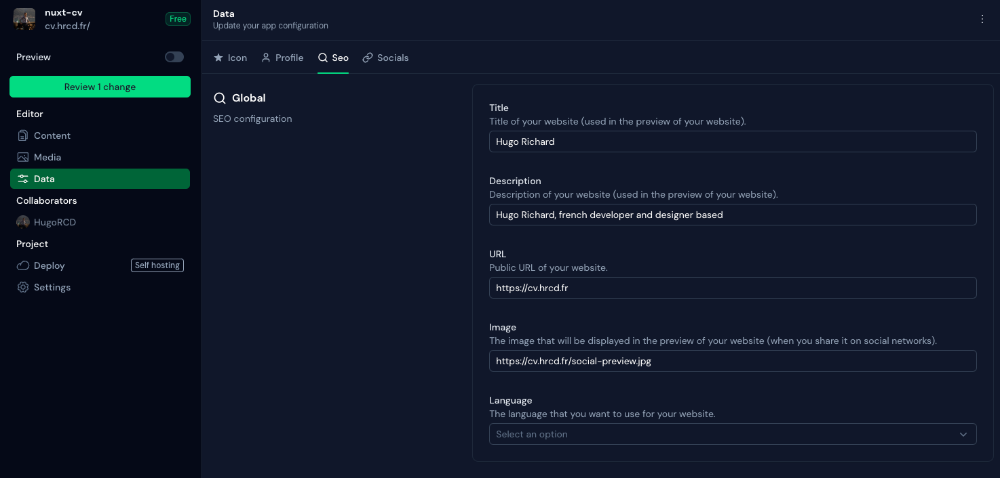

# Arslan Butt CV

Simple web app that renders a minimalist CV with a print-friendly layout.

Built with Nuxt and TailwindCSS v4.

## Live Website

You can see it live at [cv.arslan-butt.com](https://cv.arslan-butt.com/).

## Features

- Fully integrated with Nuxt Content, making it easily customizable
- Easy to customize
- Print-friendly layout



## Quick Setup

1. Clone this repository if you have access or download it from the store

```bash
git clone git@github.com:arslan-butt/my-cv.git
```

2. Install dependencies

```bash
bun install
```

3. Start the development server

```bash
bun dev
```

4. Generate the static project

```bash
bun generate
```

5. Start the production server

```bash
bun start
```
