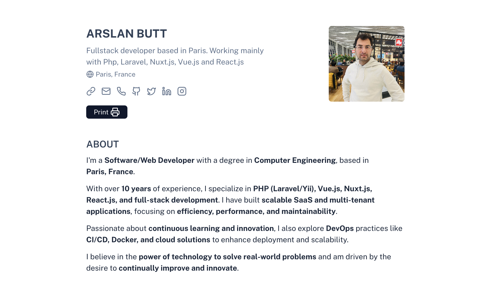

# Nuxt CV - Arslan Butt

A simple web app that renders a minimalist CV with a print-friendly layout.

Built with [**Nuxt 3**](https://nuxt.com), [**Nuxt UI 3**](https://ui3.nuxt.dev/getting-started), [**Nuxt Content v3**](https://content.nuxt.com/), [**Typescript**](https://www.typescriptlang.org/) and [**TailwindCSS v4**](https://tailwindcss.com/).

## 🌍 Live Preview

Check out the live demo of this CV template: **[Arslan Butt CV Demo](#)** (https://arslan-cv.vercel.app/).

---

## 🚀 Features

- Minimalist and print-friendly layout
- Easy to modify and extend

---

## ⚡ Quick Setup

To get started, clone this repository and install the dependencies. This project uses **Bun** as the package manager for faster and more efficient dependency management.

1. **Clone this repository**

```bash
git clone git@github.com:arslan-butt/my-cv.git
```

2. **Install dependencies**

```bash
bun install
```

3. **Start development server**

```bash
bun dev
```

4. **Generate static project**

```bash
bun generate
```

5. **Start production server**

```bash
bun start
```

Check out the [deployment documentation](https://nuxt.com/docs/getting-started/deployment) for more information.

## ✏️ How to Modify the CV Content

This portfolio uses [Nuxt Content](https://content.nuxt.com/) to manage its content.

### 🔧 Global Configuration

Before modifying specific sections, check the **`app.config.ts`** file to update global settings such as:

- Personal information
- Theme and layout preferences
- Social media and contact details

---

### 📂 Content Structure

All CV-related data is stored in the `content/` directory and organized into subfolders. Each section contains **JSON files**, where you can modify existing entries or add new ones.

```bash
content/
│
├── education/ # Academic qualifications
│ ├── education1.json
│ ├── education2.json
│
├── experiences/ # Work history & experience
│ ├── experience1.json
│ ├── experience2.json
│
└── projects/ # Projects & portfolio work
├── project1.json
├── project2.json
```

### 📚 Modify CV Sections

#### 🎓 **Education**

- Navigate to `content/education/`.
- Open any JSON file (e.g., `education1.json`) and update the details.
- To add a new entry, create a new JSON file following the same structure.

#### 💼 **Work Experience**

- Navigate to `content/experiences/`.
- Modify existing JSON files (`experience1.json`, `experience2.json`) or add new ones.

#### 🚀 **Projects**

- Navigate to `content/projects/`.
- Each JSON file represents a project. Edit or add new ones as needed.

---

### ✅ Example JSON Structure

Here's an example of how each JSON file might be structured:

```json
{
  "name": "Company name",
  "position": "Fullstack developer",
  "location": "Paris, France",
  "date": "Dec 2020 - Present",
  "description": "Developing full-stack applications using Vue.js and Laravel."
}
```

### ⚙️ Content Configuration

This project uses **Nuxt Content v3** to manage its content dynamically. The content is organized into collections, and each collection is defined and configured in the `content.config.ts` file.

The `content.config.ts` file defines the structure and schema of the collections that hold CV data, such as **Education**, **Experience**, and **Projects**.

#### 🔧 Example Content Configuration

In the `content.config.ts` file, we define the collections for **education**, **experiences**, and **projects** with specific schemas for each. Here’s an example of how it's set up:

```ts
export default defineContentConfig({
  collections: {
    ...
    experiences: defineCollection({
      type: 'data',
      source: 'experiences/**.json',
      schema: z.object({
        name: z.string(),
        position: z.string(),
        location: z.string().optional(),
        date: z.string(),
        description: z.string().optional(),
        link: z.string().optional(),
      }),
    }),
    ...
  },
});
```

## 🛠️ Contributing

Contributions are welcome! If you find any issues or have suggestions for improvements, feel free to:

- Open an [issue](https://github.com/arslan-butt/my-cv/issues).
- Submit a [pull request](https://github.com/arslan-butt/my-cv/pulls).

Please ensure your contributions align with the project's goals and follow the existing code style.

---

## 📄 License

This project is licensed under the **MIT License**. See the [LICENSE](LICENSE) file for more details.

---

## 🙏 Acknowledgments

- Thanks to the [Nuxt](https://nuxt.com) team for creating such an amazing framework.
- Shoutout to [Nuxt UI](https://ui3.nuxt.dev/) and [TailwindCSS](https://tailwindcss.com/) for making styling a breeze.
- Special thanks to the open-source community for their endless inspiration and support.

---

## 📧 Contact Me

If you have any questions, suggestions, or just want to connect, feel free to reach out:

- **Contact me via email**: [Get in touch](mailto:engr.arslanbutt@gmail.com)
- **GitHub**: [arslan-butt](https://github.com/arslan-butt)
- **LinkedIn**: [Arslan Butt](https://linkedin.com/in/engrarslanbutt)

---

Thank you for checking out my **Nuxt CV** project! I hope it helps you create a stunning and professional CV. If you enjoyed this project, don’t forget to give it a ⭐️ on GitHub!

Happy coding! 🚀
